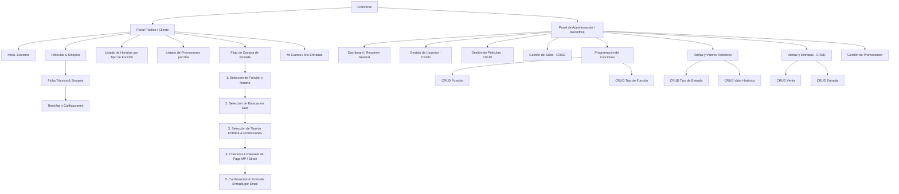

# 🗺️ Arquitectura de Información y Sitemap – Sistema de Cine

El presente sitemap organiza los módulos de la aplicación divididos en dos entornos: el **Portal del Cliente** (orientado a la consulta y compra) y el **Panel de Administración** (destinado a la gestión integral de entidades y parametrizaciones del sistema).

---

## Diagrama General del Sistema (Mermaid)

---

## Propuestas de Valor Adicional (Extras para sumar nota)

Para destacar aún más la propuesta frente al alcance voluntario sugerido, se proponen las siguientes funcionalidades de bajo costo de desarrollo pero alto impacto:

- Validador / Escáner de Entradas (Rol Operador): Vista simple optimizada para móvil donde el acomodador/personal del cine escanea el QR o ingresa el código de la entrada enviada por email, cambiando su estado en el CRUD Entrada a "Utilizada". Evita fraudes o reutilización de entradas.
- Dashboard de Métricas y Ventas: Reporte gráfico de recaudación por período, ocupación promedio por sala y las películas más taquilleras.
- Manejo de Webhooks de Pago (Mercado Pago / Stripe): Actualización asíncrona y automática del estado de la Venta y la Entrada en caso de pagos aprobados, rechazados o cancelados.
- Política de Anulación / Devolución: Permite al usuario cancelar su compra con al menos 2 horas de anticipación a la función, liberando las butacas en la sala.

---

## Puntos clave que valorarán los evaluadores en este diseño

- **Trazabilidad 1:1:** Cada uno de los 9 CRUDs y los 4 CUU principales tiene su pantalla/flujo claramente identificado.
- **Relación Sala-Función-Valor Histórico:** Se explica claramente por qué existe el `CRUD Valor Histórico` (evita que si mañana sube el precio de la entrada, se modifiquen erróneamente los reportes de ventas del mes pasado).
- **Alcance voluntario integrado:** El listado de horarios por tipo de función, las promos por día, las reseñas y el envío de email quedan integrados de forma natural en el flujo del usuario.
